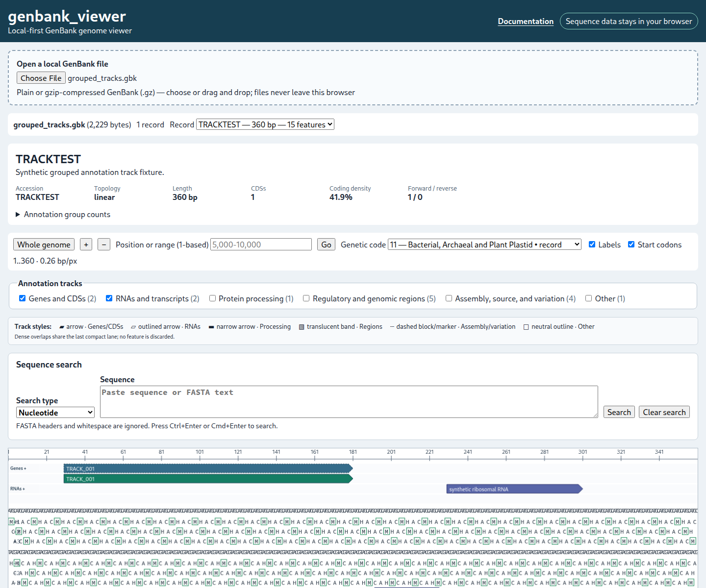
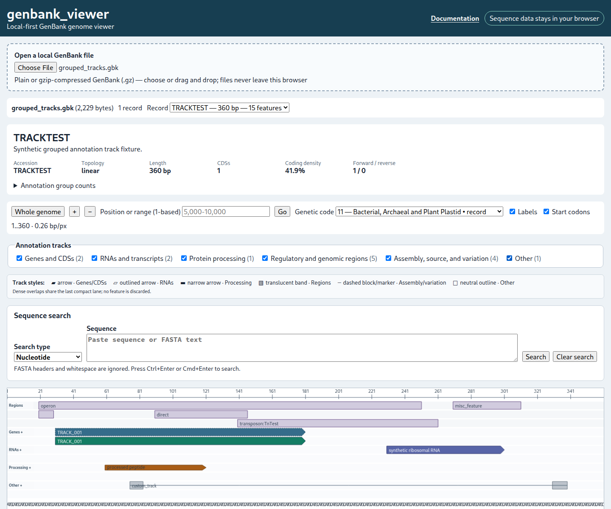

# Annotation tracks

The **Annotation tracks** controls group GenBank feature keys into six viewer-specific display groups. **Genes and CDSs** and **RNAs and transcripts** are visible initially; the other four groups are opt-in. Summary counts include hidden features.

Enable any group to add its tracks. Forward and reverse annotations are separated, broad regions appear behind genes, and each group uses a distinct visual treatment described in the on-page **Track styles** legend.

Overlapping features are packed deterministically into at most three lanes per group and strand. If density exceeds that limit, additional overlaps share the final compact lane; features are not discarded. Turning off the group containing the selected feature also clears the inspector selection.

These display groups are not GenBank qualifiers and are not an INSDC hierarchy. See [Feature keys and display groups](feature-groups.md) for the exact registry.
