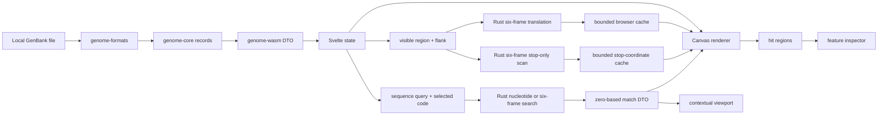

# Architecture

`genome-core` owns browser-independent models, coordinates, extraction, translation, exact sequence searching, stop-only regional scans, and coding unions. `genome-formats` parses records and warnings. `genome-wasm` converts those values to stable camel-case DTOs and structured errors. `web` owns file UI, record/viewport state, bounded translation and stop caches, interactions, independent Canvas rendering, hit testing, search navigation, and inspection.

Parsing tests cover syntax and warnings; core tests cover coordinates, extraction, translation, IUPAC matching, six-frame match mapping, and coding unions; Vitest covers transformations, search navigation, viewports, and geometry; Playwright covers local upload and both search modes through the rendered UI.

The browser's File API reads `.gb`, `.gbk`, `.genbank`, and `.gbff` text. Svelte passes that text to the wasm-bindgen export `parse_genbank_json`, and the returned records drive the viewer. The application has no backend or upload step. `wasm-pack` generates a standard ES-module loader, and Vite rewrites its relative WASM URL into the configured `/genbank_viewer/` asset base for GitHub Pages.

Search text and the selected record sequence are passed to the thin `search_sequence_json` WASM export. `genome-core` normalizes and validates the query, scans IUPAC nucleotide windows or translates one reading frame at a time, and returns sorted forward-reference intervals. Svelte converts the selected match into a clamped viewport; the Canvas renderer paints a separate non-interactive highlight layer. No whole-genome translation strings are constructed in TypeScript.

The renderer centralises its mode threshold and row coordinates in `RENDER_CONFIG` and `viewerLayout()`. At more than 1.6 bases per CSS pixel, `stop_tracks` mode requests only stop coordinates through `stop_codons_in_region_json`; it draws six labelled bands between the forward and reverse features and pixel-deduplicates bars only while painting. At or below 1.6 bases per pixel, `sequence` mode retains the regional full-codon DTO and detailed nucleotide/amino-acid renderer. Both bounded caches include record identity, exact visible interval, and genetic-code ID.

Canvas translation requests carry a monotonically increasing request number. A result is installed only if it is still the newest request and still matches the current render mode, preventing an older pan, zoom, or code selection from repainting stale tracks. Device-pixel-ratio scaling remains in `GenomeCanvas`; all layout and stop positions are expressed in CSS pixels before the context transform.
