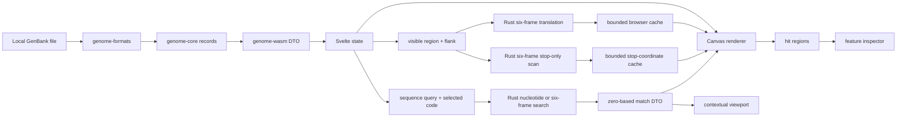

# Architecture

`genome-core` owns browser-independent models, coordinates, extraction, translation, exact sequence searching, stop-only regional scans, and coding unions. `genome-formats` parses records and warnings. `genome-wasm` converts those values to stable camel-case DTOs and structured errors. `web` owns file UI, record/viewport state, bounded translation and stop caches, interactions, independent Canvas rendering, hit testing, search navigation, and inspection.

Parsing tests cover syntax and warnings; core tests cover coordinates, extraction, translation, IUPAC matching, six-frame match mapping, and coding unions; Vitest covers transformations, search navigation, viewports, and geometry; Playwright covers local upload and both search modes through the rendered UI.

The browser's File API reads `.gb`, `.gbk`, `.genbank`, and `.gbff` text. Svelte passes that text to the wasm-bindgen export `parse_genbank_json`, and the returned records drive the viewer. The application has no backend or upload step. `wasm-pack` generates a standard ES-module loader, and Vite rewrites its relative WASM URL into the configured `/genbank_viewer/` asset base for GitHub Pages.

Search text and the selected record sequence are passed to the thin `search_sequence_json` WASM export. `genome-core` normalizes and validates the query, scans IUPAC nucleotide windows or translates one reading frame at a time, and returns sorted forward-reference intervals. Svelte converts the selected match into a clamped viewport; the Canvas renderer maps the unchanged DTO to current-mode geometry at draw time. Peptides target one shared `FrameRowLayout`; nucleotides target shared forward/reverse `NucleotideRowLayout` entries. No whole-genome translation strings are constructed in TypeScript.

The renderer centralises its mode threshold and row coordinates in `RENDER_CONFIG` and `viewerLayout()`. At more than 1.6 bases per CSS pixel, `stop_tracks` mode requests only stop coordinates through `stop_codons_in_region_json`; it draws six labelled bands plus narrow `F nt`/`R nt` search lanes between the forward and reverse features and pixel-deduplicates bars only while painting. At or below 1.6 bases per pixel, `sequence` mode retains the regional full-codon DTO and detailed nucleotide/amino-acid renderer. Both bounded caches include record identity, exact visible interval, and genetic-code ID.

Highlight painting uses a stable layered flow: row backgrounds, translucent hatched highlight, features or sequence content, stop bars and row labels, then the highlight boundary and compact label. `searchHighlightGeometries()` receives the current `ViewerLayout`, uses `frameRowFor()` or `nucleotideRowFor()`, clips at Canvas edges, and never creates a hit region. Crossing the render threshold recomputes only Canvas geometry; it does not mutate the selected search DTO or require another search request.

Canvas translation requests carry a monotonically increasing request number. A result is installed only if it is still the newest request and still matches the current render mode, preventing an older pan, zoom, or code selection from repainting stale tracks. Device-pixel-ratio scaling remains in `GenomeCanvas`; all layout and stop positions are expressed in CSS pixels before the context transform.

## Grouped annotation tracks

`web/src/lib/featureGroups.ts` is the authoritative case-insensitive display registry. It classifies preserved parser DTOs without changing feature keys or qualifiers. `buildViewerLayout()` creates rows only for enabled group/strand combinations, then positions the shared nucleotide-search, six-frame, and detailed sequence rows around them. Canvas height follows the active rows rather than fixed feature Y coordinates.

Visible features are greedily lane-packed per group and strand after sorting by start, longest end, and feature ID. Joined features use their bounding interval for packing while retaining every constituent piece for drawing and hit testing. Packing is capped at three lanes; excess overlap uses a deterministic compact fallback rather than dropping annotations.

Visual stacking and hit priority proceed from source/assembly and broad regions to gene, RNA, and processing annotations. Thus source wins a click only when no more specific visible feature occupies the hit position. Search highlights remain non-interactive.

## Frontend state and component contracts

`App.svelte` owns the loaded records, selected record/feature, viewport, genetic code, visible groups, and search state. `FileLoader` emits decoded text and file metadata; `GenomeCanvas` accepts immutable render inputs and emits viewport/selection events; `SequenceSearch` emits search, navigation, clear, and type-change events; `FeatureInspector` can request a declared feature code. State is not persisted to browser storage.

`GenomeCanvas.updateRenderData()` assigns each asynchronous WASM request a monotonically increasing number and discards a result when a newer request or different render mode has superseded it. This prevents a slow translation or stop scan from repainting stale data after rapid pan, zoom, or genetic-code changes.

See locally generated [Rust API documentation](development.md#rust-api-documentation) for public crate contracts and [Maintaining documentation](documentation.md) for keeping architecture text and screenshots aligned with UI changes.
