# Architecture

`genome-core` owns browser-independent models, coordinates, extraction, translation, and coding unions. `genome-formats` parses records and warnings. `genome-wasm` converts those values to stable camel-case DTOs and structured errors. `web` owns file UI, record/viewport state, a bounded regional-translation cache, interactions, independent Canvas rendering, hit testing, and inspection.

```mermaid
flowchart LR
  File[Local GenBank file] --> Parser[genome-formats]
  Parser --> Core[genome-core records]
  Core --> DTO[genome-wasm DTO]
  DTO --> State[Svelte state]
  State --> Canvas[Canvas renderer]
  Canvas --> Hit[hit regions]
  Hit --> Inspector[feature inspector]
  State --> Region[visible region + flank]
  Region --> Translate[Rust six-frame translation]
  Translate --> Cache[bounded browser cache]
  Cache --> Canvas
```

Parsing tests cover syntax and warnings; core tests cover coordinates, extraction, translation, and coding unions; Vitest covers transformations and geometry; Playwright covers local upload through rendered UI.
