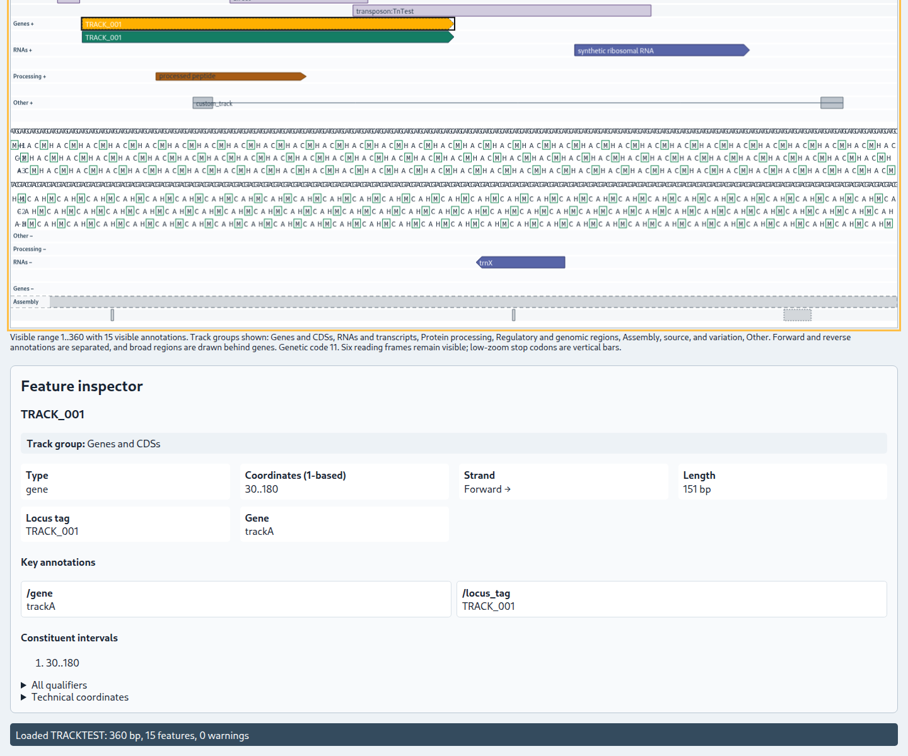

# Feature inspection

Select a feature shape in the Canvas to open the **Feature inspector** below the full-width viewer. The inspector reports the original GenBank feature key, display group, forward-reference coordinates, strand, joined parts, display label, and promoted biological annotations.

The display label uses the first available `/locus_tag`, `/gene`, `/protein_id`, or `/product`, in that order. Regulatory, repeat, and mobile-element features may use their subtype qualifier as a more informative Canvas label.

For a CDS with a valid `/transl_table`, the inspector shows the declared table. **Use feature code N** changes the viewer's global **Genetic code** selection; it does not edit the file. Expand **All qualifiers** to see every retained qualifier, including repeated and valueless entries.

See [Qualifiers](qualifiers.md) and [Genetic codes](genetic-codes.md).
