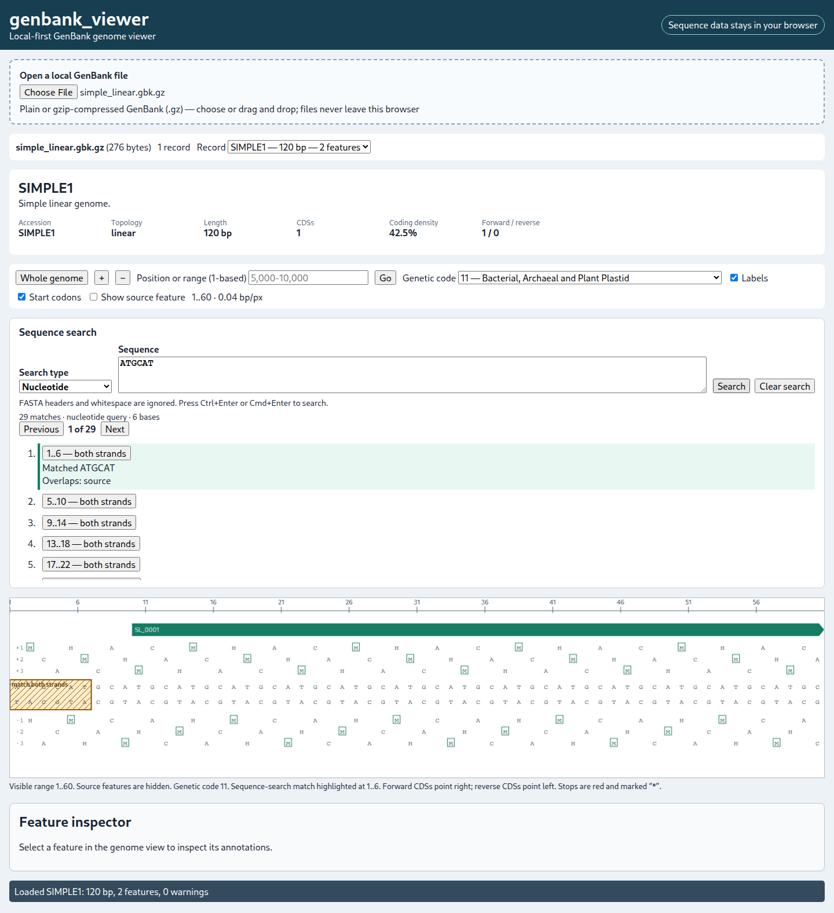

# How to use genbank_viewer

1. Open the genbank_viewer URL in a supported browser.
2. Under **Open a local GenBank file**, choose a `.gb`, `.gbk`, `.genbank`, or `.gbff` file. Gzip forms such as `.gb.gz`, `.gbk.gz`, `.genbank.gz`, and `.gbff.gz` are also accepted and decompressed locally.
3. Alternatively, drag the file onto the dashed loading area. The filename, size, parsing state, record count, and warning count appear.
4. For a multi-record file, choose **Record**. The selector shows ID, length, and feature count; changing records resets the view and selection.
5. The initial whole-genome view shows a ruler and feature tracks. Whole-record `source` annotations are hidden by default so they do not cover CDSs. Use **Show source feature** to display their subdued, dashed track.
6. Green right-pointing arrows are forward CDSs; purple left-pointing arrows are reverse CDSs. Joined blocks have connectors and partial blocks use dashed edges.
7. Wheel or trackpad scroll around the pointer to zoom without losing the position beneath it. Double-click also zooms in.
8. Drag horizontally, or focus the Canvas and use Left/Right arrows, to pan.
9. Enter `5000`, `5000..10000`, or `5,000-10,000` in the 1-based range field and press **Go**.
10. Use `+`/`-` or the buttons until bases appear.
11. The forward sequence is above the reverse-complement sequence; both align to forward-reference coordinates.
12. Frames `+1`, `+2`, `+3` translate the reference, while `-1`, `-2`, `-3` translate its reverse complement. Frame alignment always comes from the whole record.
13. Stops are red `*`. Enable **Start codons** to outline accepted starts; starts are a codon property and do not change the amino-acid letter.
14. **Genetic code** chooses among all current NCBI translation tables. Table 11 (Bacterial, Archaeal and Plant Plastid) remains the default. Options marked “record” occur in a `/transl_table` qualifier in the current record.
15. Click a CDS arrow to select it; click empty Canvas space to clear it.
16. The full-width Feature Inspector is directly below the Canvas. It shows locus tag, product, gene, protein ID, translation, every qualifier, joined intervals, partial boundaries, and technical `[start,end)` coordinates.
17. When a selected CDS declares `/transl_table`, the inspector displays it prominently. **Use feature code N** changes the viewer only when requested; selecting a feature never changes the global code automatically.
18. Coding density is the percentage of bases covered by the union of CDS parts, so overlaps are counted once.
19. Expand parser warnings to review length mismatches, unsupported locations, malformed qualifiers, and out-of-bounds features.
20. For malformed files, use the error’s record, line, and offending text; **Copy details** prepares debugging information. Unsupported locations are preserved, never converted to misleading bounding boxes.
21. genbank_viewer parses and decompresses files locally. It has no upload endpoint or analytics call.

Alternative nuclear tables 27, 28, and 31 include codons whose stop-versus-amino-acid meaning can depend on biological context. The viewer follows NCBI's conventional table row for bare-codon display; it does not model organism-specific termination context.

## Searching by nucleotide or amino-acid sequence

Open a record, then use **Sequence search** above the genome Canvas. Choose **Nucleotide** or **Amino acid**, paste a sequence, and press **Search**. A textarea accepts FASTA headers and wrapped sequences; press Ctrl+Enter or Cmd+Enter to search from the keyboard. Whitespace and header lines beginning with `>` are removed, letters are uppercased, and RNA `U` is treated as DNA `T`. Other punctuation and digits produce an explicit validation error.

Nucleotide searches examine the forward reference and the reverse complement. IUPAC symbols `RYSWKMBDHVN` are supported in both query and record: positions match when their possible-base sets overlap. Palindromic or otherwise identical forward/reverse hits are reported once as **both strands**. Queries must contain at least three bases.

Amino-acid searches translate all six genomic frames with the genetic code currently selected in the toolbar. Results identify frames `+1` through `+3` or `-1` through `-3`, and their coordinates span all codons encoding the peptide. `X` matches any translated residue except a stop; `B` matches D/N, `Z` matches E/Q, `J` matches I/L, and `*` matches a stop exactly. Peptide queries must contain at least two residues. Changing the genetic code automatically repeats a current peptide search because codon interpretation can change.

Result coordinates are one-based and inclusive even though the application uses zero-based, half-open intervals internally. The first hit is selected automatically. Use **Previous**, **Next**, or a result row to centre it with flanking context; navigation wraps at either end. A hatched, labelled band marks the interval without changing feature selection or hit testing. **Clear search** removes the query, results, and highlight. Loading another file or record also clears them.

Searching is exact: there are no mismatches, gaps, alignments, regular expressions, or protein-domain searches. All normalization, six-frame translation, matching, navigation data, and highlighting remain inside the browser; query and record sequences are never uploaded.

To regenerate screenshots, run the development server, load `test-data/two_records.gbk`, capture whole-genome and base-resolution views at 1440 px width, and replace the named placeholder while keeping useful alternative text.
