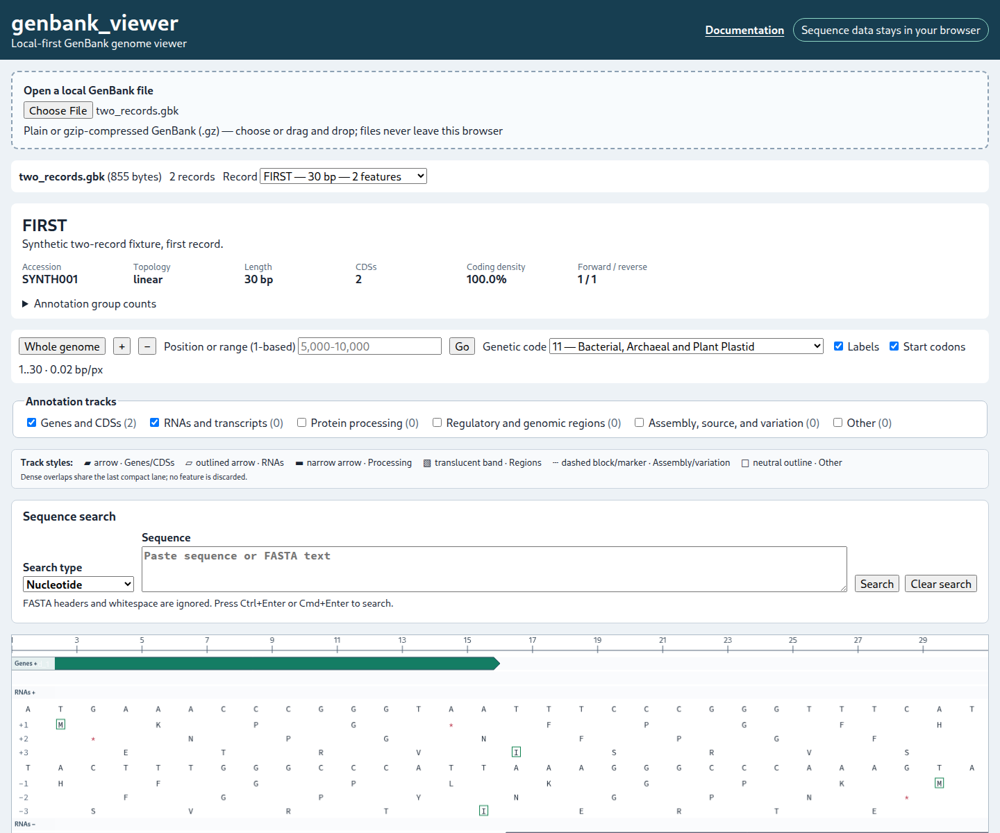

# How to use genbank_viewer

Open the [live application](https://linsalrob.github.io/genbank_viewer/) in a current Chrome, Edge, Firefox, or Safari browser. No account is needed.

1. Open the genbank_viewer URL in a supported browser.
2. Under **Open a local GenBank file**, choose a `.gb`, `.gbk`, `.genbank`, or `.gbff` file. Gzip forms such as `.gb.gz`, `.gbk.gz`, `.genbank.gz`, and `.gbff.gz` are also accepted and decompressed locally.
3. Alternatively, drag the file onto the dashed loading area. The filename, size, parsing state, record count, and warning count appear.
4. For a multi-record file, choose **Record**. The selector shows ID, length, and feature count; changing records resets the view and selection.
5. The initial whole-genome view shows a ruler, Genes/CDSs and RNA tracks, six stop-codon tracks, and separated reverse features. Whole-record `source` annotations are hidden by default; enable **Assembly, source, and variation** to display their subdued, dashed track.
6. Green right-pointing arrows are forward CDSs; purple left-pointing arrows are reverse CDSs. Joined blocks have connectors and partial blocks use dashed edges.
7. Wheel or trackpad scroll around the pointer to zoom without losing the position beneath it. Double-click also zooms in.
8. Drag horizontally, or focus the Canvas and use Left/Right arrows, to pan.
9. Enter `5000`, `5000..10000`, or `5,000-10,000` in the 1-based range field and press **Go**.
10. In zoomed-out and intermediate views, rows `+1`, `+2`, and `+3` are the three forward-reference reading frames; `-1`, `-2`, and `-3` are the three reverse-complement frames. A thin vertical bar marks each stop codon at its genomic centre. At whole-genome scale, nearby stops can share a screen pixel and merge visually without changing their biological coordinates.
11. Use `+`/`-` or the buttons until nucleotide and amino-acid letters appear. The renderer changes from stop tracks to detailed sequence mode at 1.6 bases per CSS pixel.
12. The forward sequence is above the reverse-complement sequence; both align to forward-reference coordinates.
13. Frames `+1`, `+2`, `+3` translate the reference, while `-1`, `-2`, `-3` translate its reverse complement. Frame alignment always comes from the whole record.
14. In detailed mode, stops are red `*`. Enable **Start codons** to outline accepted starts; starts are a codon property and do not change the amino-acid letter.
15. **Genetic code** chooses among all current NCBI translation tables and controls the compact stop bars as well as detailed letters, starts, and stops. Table 11 (Bacterial, Archaeal and Plant Plastid) remains the default. Options marked “record” occur in a `/transl_table` qualifier in the current record.
16. Click a CDS arrow to select it; click empty Canvas space to clear it.
17. The full-width **Feature inspector** is directly below the Canvas. It shows locus tag, product, gene, protein ID, translation, every qualifier, joined intervals, partial boundaries, and technical `[start,end)` coordinates.
18. When a selected CDS declares `/transl_table`, the inspector displays it prominently. **Use feature code N** changes the viewer only when requested; selecting a feature never changes the global code automatically.
19. Coding density is the percentage of bases covered by the union of CDS parts, so overlaps are counted once.
20. Expand parser warnings to review length mismatches, unsupported locations, malformed qualifiers, and out-of-bounds features.
21. For malformed files, use the error’s record, line, and offending text; **Copy details** prepares debugging information. Unsupported locations are preserved, never converted to misleading bounding boxes.
22. genbank_viewer parses and decompresses files locally. It has no upload endpoint or analytics call.

Alternative nuclear tables 27, 28, and 31 include codons whose stop-versus-amino-acid meaning can depend on biological context. The viewer follows NCBI's conventional table row for bare-codon display; it does not model organism-specific termination context.

## Continue with focused guides

- [Loading files](loading-files.md)
- [Navigating and zooming](navigation.md)
- [Annotation tracks](annotation-tracks.md)
- [Feature inspection](feature-inspection.md)
- [Six reading frames](translation.md)
- [Sequence-search semantics](search-semantics.md)
- [Genetic codes](genetic-codes.md)
- [Warnings and errors](warnings-and-errors.md)
