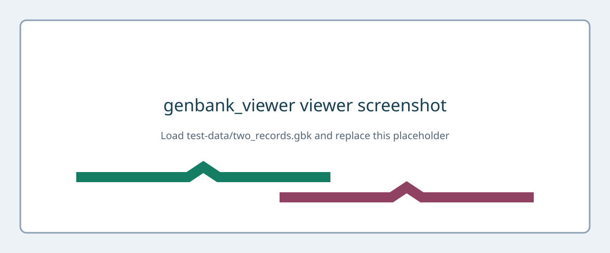

# How to use Webtemis

1. Open the Webtemis URL in a supported browser.
2. Under **Open a local GenBank file**, choose a `.gb`, `.gbk`, `.genbank`, or `.gbff` file.
3. Alternatively, drag the file onto the dashed loading area. The filename, size, parsing state, record count, and warning count appear.
4. For a multi-record file, choose **Record**. The selector shows ID, length, and feature count; changing records resets the view and selection.
5. The initial whole-genome view shows a ruler and feature tracks. Press **Whole genome** or `Home` to return.
6. Green right-pointing arrows are forward CDSs; purple left-pointing arrows are reverse CDSs. Joined blocks have connectors and partial blocks use dashed edges.
7. Wheel or trackpad scroll around the pointer to zoom without losing the position beneath it. Double-click also zooms in.
8. Drag horizontally, or focus the Canvas and use Left/Right arrows, to pan.
9. Enter `5000`, `5000..10000`, or `5,000-10,000` in the 1-based range field and press **Go**.
10. Use `+`/`-` or the buttons until bases appear.
11. The forward sequence is above the reverse-complement sequence; both align to forward-reference coordinates.
12. Frames `+1`, `+2`, `+3` translate the reference, while `-1`, `-2`, `-3` translate its reverse complement. Frame alignment always comes from the whole record.
13. Stops are red `*`. Enable **Start codons** to outline accepted starts; starts are a codon property and do not change the amino-acid letter.
14. **Genetic code** switches between table 11 (default bacterial/archaeal/plastid starts) and table 1 (standard starts).
15. Click a CDS arrow to select it; click empty Canvas space to clear it.
16. The inspector shows its locus tag, product, gene, protein ID, translation, every qualifier, joined intervals, partial boundaries, and technical `[start,end)` coordinates.
17. Coding density is the percentage of bases covered by the union of CDS parts, so overlaps are counted once.
18. Expand parser warnings to review length mismatches, unsupported locations, malformed qualifiers, and out-of-bounds features.
19. For malformed files, use the error’s record, line, and offending text; **Copy details** prepares debugging information. Unsupported locations are preserved, never converted to misleading bounding boxes.
20. Webtemis parses files locally. It has no upload endpoint or analytics call.

To regenerate screenshots, run the development server, load `test-data/two_records.gbk`, capture whole-genome and base-resolution views at 1440 px width, and replace the named placeholder while keeping useful alternative text.
