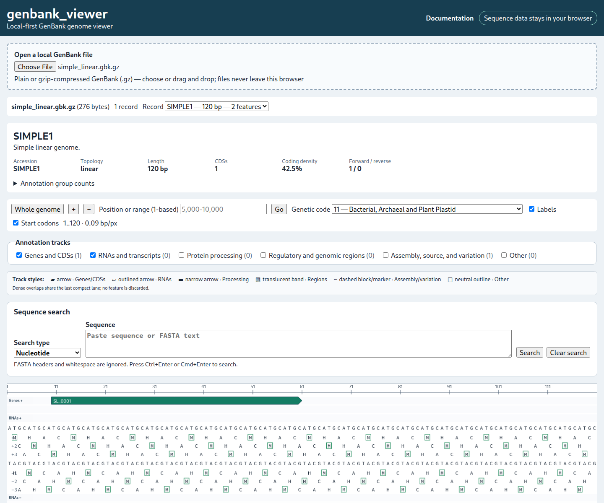

# Loading files

genbank_viewer reads GenBank files selected from the local computer. Choose **Choose GenBank file** or drag a file onto the drop area. The accepted names are `.gb`, `.gbk`, `.genbank`, and `.gbff`; each may also end in `.gz`, for example `sample.gbk.gz`. Extension matching is case-insensitive.

Plain files are decoded as UTF-8 in the browser. Gzip files are decompressed in the browser with `DecompressionStream` when available and the bundled `fflate` fallback otherwise. The decompressed text is passed to the local Rust/WebAssembly parser; it is not uploaded.

When a file contains multiple records separated by `//`, the **Record** list shows every parsed record. Selecting a different record resets the viewport, feature selection, and current sequence search.

The filename, byte size, record count, accession, topology, sequence length, CDS count, coding density, strand counts, and annotation-group counts appear after loading. For rejected files and parser diagnostics, see [Warnings and errors](warnings-and-errors.md). For exact syntax coverage, see [GenBank support](genbank-support.md).
