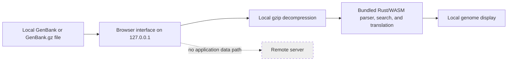

# Standalone and offline installation

genbank_viewer can process GenBank files entirely on your own computer. Once an offline-capable installation is complete, opening, decompressing, parsing, translating, searching, and displaying sequence files does not require internet access.

“Offline” in this guide means that the application assets and its local web server are already on the computer, the browser opens a `127.0.0.1` address, and no connection to the public internet is needed. `127.0.0.1` is the computer's private loopback address: traffic to it does not leave the computer.

## Current installation status

The repository currently supports one offline method: build the production web application from source, retain the installed Node.js packages, and run Vite's local preview server on `127.0.0.1`. This is a local static web application. It is not a normal desktop application: the user starts a small local server before opening the browser and stops it afterward.

The following methods are **not currently available**:

- no prebuilt Windows, Linux, macOS, or ChromeOS packages or installers;
- no desktop wrapper such as Tauri, Electron, Neutralino, or Wails;
- no web-app manifest or service worker, so no installable offline Progressive Web App (PWA);
- no automatic updater, release-package workflow, published checksum file, or signed/notarised package. The current GitHub release tag has no downloadable assets.

The hosted GitHub Pages application requires internet access whenever its uncached assets must load. Normal browser caching is not an offline-installation guarantee.

## Quick recommendation

| User | Recommended current choice |
|---|---|
| Ordinary Windows user | There is no ordinary-user installer yet. If command-line setup is acceptable, use the [Windows local-build guide](install-windows.md); otherwise use the hosted site while online. |
| Ordinary Linux user | Use the [Linux local-build guide](install-linux.md) if Node.js and Rust can be installed without disrupting system packages. |
| macOS user | There is no `.dmg` or `.app`. Use the [macOS local-build guide](install-macos.md) if command-line setup is acceptable. |
| Chromebook user | There is no PWA. Use the [Linux-container method](install-chromebook.md), subject to administrator policy and available storage. |
| Restricted or air-gapped institution | Build and test on an internet-connected preparation computer, transfer the complete checkout including `web/dist` and `web/node_modules`, then run it locally. Review the caveats below. |
| Developer | Follow the advanced clean-checkout procedure below; use `npm run dev` only for development, not as the documented offline production method. |

## Installation-method comparison

| Method | Internet needed for installation | Works later offline | Administrator rights | Automatic updates | Best for |
|---|---:|---:|---:|---:|---|
| Hosted GitHub Pages site | Yes, when loading uncached assets | Not guaranteed | No | New site version on reload | Online evaluation |
| Local production build served by Vite | Yes, to obtain source, tools, Rust crates, and npm packages | Yes, after a complete build | Usually no if tools can be installed in a user account | No | Current reliable offline use and technical users |
| Development server | Yes, to prepare dependencies | Yes, after preparation | Usually no | No | Software development only |

PWA and desktop-package rows are omitted because those methods are not implemented.

## What the production build contains

`npm run build` creates `web/dist`. The generated application contains the browser interface, JavaScript, CSS, the Rust-generated WASM parser and biological functions, and other local assets. Gzip decompression uses either a browser API or the bundled `fflate` JavaScript library. Genetic-code definitions are compiled into the WASM module. There are currently no separate application icons, external fonts, or downloaded runtime data files.

After the build is complete, runtime sequence processing does not require Python, Java, Rust, `rustup`, `wasm-pack`, a remote API, a database server, or internet access. The documented local-server method **does** retain Node.js, npm, Vite, and `web/node_modules` to launch the application. Rust, `wasm-pack`, Node.js, and npm are required while building from source.

## Advanced: build a local production installation

### Prerequisites while online

- Git;
- Rust 1.85 or newer, normally installed with `rustup`;
- the `wasm32-unknown-unknown` Rust target;
- `wasm-pack` (the repository does not pin an exact version);
- Node.js 20 or newer and npm 10 or newer;
- enough storage for the checkout, Rust build files, and `web/node_modules`;
- a current Chrome, Edge, Firefox, or Safari browser.

Python 3.10 or newer and the packages in `requirements-docs.txt` are needed only to build this documentation. No system webview library is required because this method uses an ordinary browser rather than a desktop wrapper.

### Build from a clean checkout

Run these commands while internet access is available:

```bash
git clone https://github.com/linsalrob/genbank_viewer.git
cd genbank_viewer
rustup target add wasm32-unknown-unknown
cargo install wasm-pack
cd web
npm ci
npm run build
```

Expected result: `web/dist/index.html` exists, `web/dist/assets` contains JavaScript and CSS, and at least one file there ends in `.wasm`. Do not open `dist/index.html` through a `file://` URL; the ES modules, absolute project path, and WASM fetch require HTTP.

### Launch later without internet access

From the retained `web` directory:

```bash
npm run preview -- --host 127.0.0.1
```

Open <http://127.0.0.1:4173/genbank_viewer/>. Leave the terminal window open. Press <kbd>Ctrl</kbd>+<kbd>C</kbd> in that terminal to stop the server.

The `127.0.0.1` binding prevents other computers on the local network from opening the server. Do not change it to `0.0.0.0` unless sharing the application on a trusted network is an intentional, reviewed decision. The server does not start automatically; a shortcut may open a terminal and run the command, but shortcut syntax differs by operating system and is not supplied by the project.

Vite is distributed under the MIT licence and runs under Node.js. Both are retained as build dependencies in `web/node_modules`; this project does not currently bundle a separate lightweight runtime server.

## Files and privacy

GenBank files are selected from the local filesystem. The browser reads them into memory; gzip decompression, parsing, feature display, exact nucleotide search, six-frame peptide search, translation, and genetic-code switching occur locally. The application has no code path that needs to upload a sequence file.

These statements describe the audited repository version. A hosting service, modified build, browser extension, browser crash reporter, or future version can affect privacy. Follow [Offline verification](offline-verification.md) before working with sensitive data.

## Restricted-network and air-gapped preparation

A source build needs many downloads and is substantially more complicated than installing a prebuilt package. `cargo build`, `cargo install`, and `npm ci` do not work offline unless all required toolchains, crates, packages, and platform binaries are already cached or vendored.

The most practical current workflow is:

1. On an approved internet-connected computer with the **same operating system and CPU architecture** as the destination, download the source checkout, Rust toolchain, `wasm32-unknown-unknown` target, `wasm-pack`, Node.js, npm packages, Rust crates, and a copy of this documentation.
2. Run the complete build and tests there.
3. Retain the complete checkout, especially `web/dist`, `web/node_modules`, `web/package.json`, and `web/package-lock.json`. Also obtain a compatible Node.js runtime for the destination.
4. Generate institutional SHA-256 checksums for the transferred files or archive. The project does not currently publish checksums.
5. Transfer the prepared files and Node.js runtime using approved removable media. Scanning and media-control requirements remain institution-specific.
6. Verify the recorded checksums on the destination computer.
7. Run `npm run preview -- --host 127.0.0.1` from `web`, with no network connection.
8. Complete the [basic and advanced offline tests](offline-verification.md).

Copying `node_modules` across different operating systems or CPU architectures is unsupported because it contains platform-specific packages. For a rigorously reproducible air-gapped build environment, prepare an offline Rust toolchain and crate cache, Node.js distribution, npm cache, `wasm-pack`, and system dependencies for the exact target platform. The repository does not yet provide a vendored dependency bundle or air-gap bootstrap script.

## Checksums

There are no published release packages or checksum files to compare today; the current GitHub release entry has no assets. If a trusted source supplies a future package and a published SHA-256 checksum, calculate its value as follows and compare every character with the published value.

Windows PowerShell:

```powershell
Get-FileHash .\genbank_viewer-<version>-<platform>.<ext> -Algorithm SHA256
```

Linux:

```bash
sha256sum genbank_viewer-<version>-<platform>.<ext>
```

macOS:

```bash
shasum -a 256 genbank_viewer-<version>-<platform>.<ext>
```

The placeholders are not real filenames. Never treat an example value or a checksum obtained from an untrusted channel as authoritative.

## Next steps

- [Windows](install-windows.md)
- [Linux](install-linux.md)
- [macOS](install-macos.md)
- [Chromebook](install-chromebook.md)
- [Verify offline operation](offline-verification.md)
- [Update and uninstall](updating-and-uninstalling.md)
- [Troubleshoot offline use](troubleshooting-offline.md)


