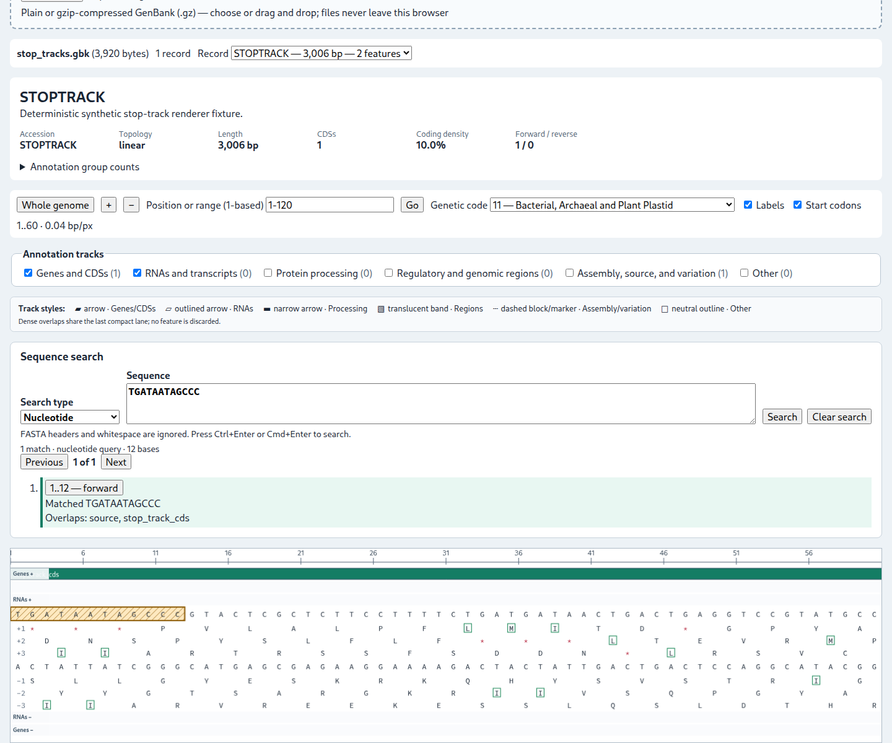
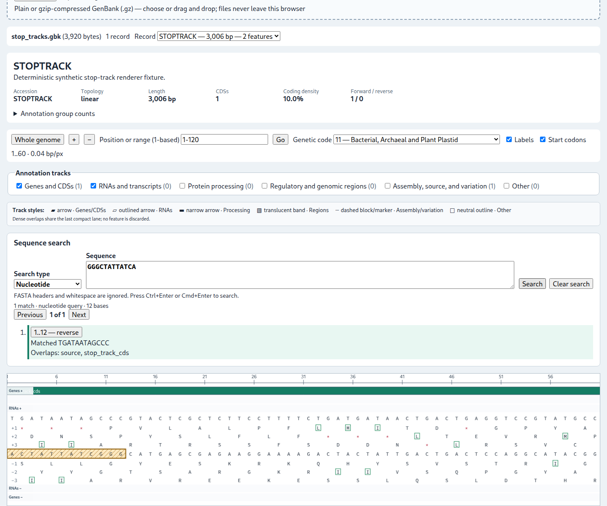
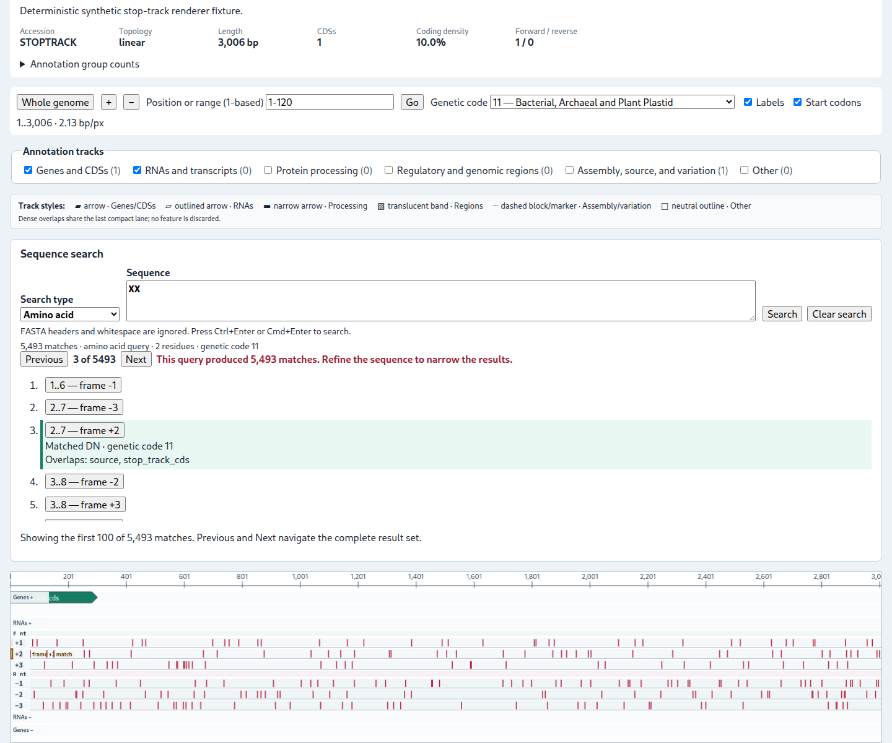
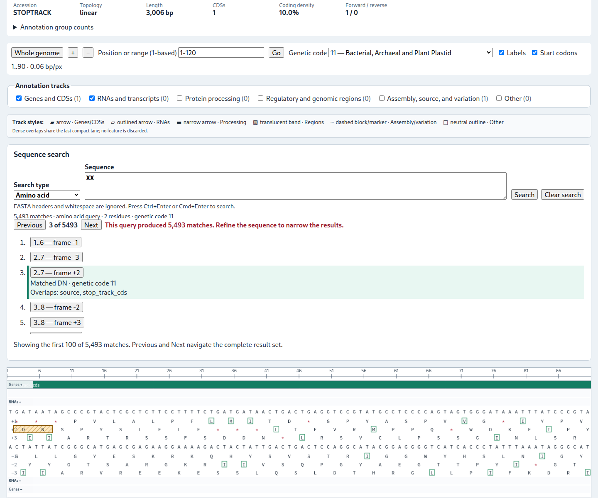
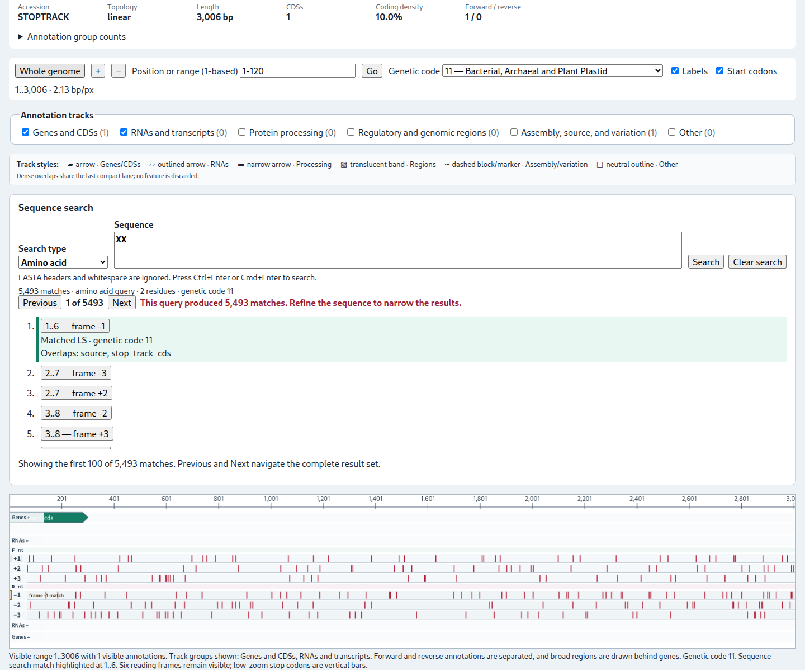

# Sequence-search semantics

The **Sequence search** panel performs exact local searches. Choose **Nucleotide** or **Amino acid**, enter a query, and select **Search**. <kbd>Ctrl</kbd>+<kbd>Enter</kbd> or <kbd>Command</kbd>+<kbd>Enter</kbd> also submits. **Previous**, **Next**, and result rows navigate; navigation wraps at both ends. The implementation does not impose a result-count limit.

FASTA header lines whose first non-whitespace character is `>` are ignored. Remaining whitespace is removed and letters are uppercased.

## Nucleotide search

- Minimum length: three symbols.
- Alphabet: `A C G T U R Y S W K M B D H V N`; `U` becomes `T`.
- Query and record IUPAC symbols match when their possible-base sets intersect.
- Both the query and its reverse complement are searched at every overlapping position.
- A palindromic query, or a location matching both orientations through ambiguity, produces one **both strands** result rather than duplicates.
- Results use forward-reference, one-based inclusive coordinates.

## Amino-acid search

- Minimum length: two residues.
- The standard one-letter amino-acid alphabet and `*`, `X`, `B`, `Z`, and `J` are accepted.
- `*` matches a stop; `X` matches any non-stop residue; `B` matches D or N; `Z` matches E or Q; `J` matches I or L.
- All three frames on the forward reference and all three frames on its reverse complement are searched.
- Translation uses the selected **Genetic code**. Changing the code reruns a current peptide query.
- Results identify frame `+1` through `+3` or `-1` through `-3` and use forward-reference coordinates.

At low zoom, highlights target one peptide frame or the `F nt`/`R nt` lanes. At high zoom they target the corresponding letter row. Selecting a result centres it with context; the interval itself does not change across render modes.

Search is exact. It does not support gaps, substitutions, regular expressions, approximate alignment, BLAST, protein domains, or translated searches of annotated CDS products only.
