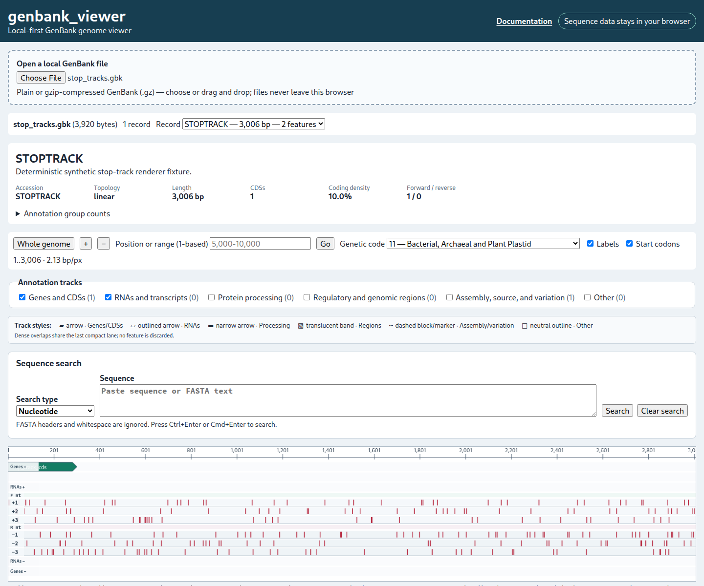
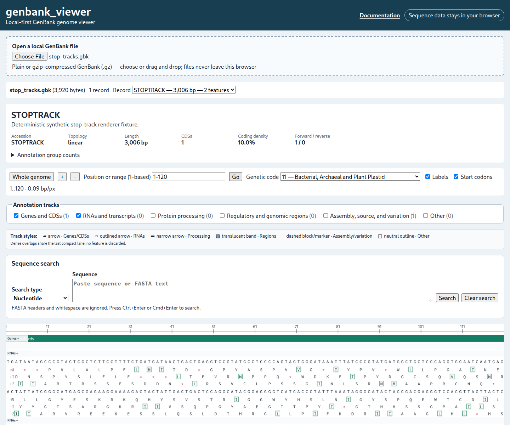

# Translation

At more than 1.6 bases per CSS pixel, genbank_viewer draws table-specific stop codons as bars in six compact reading-frame rows.

At 1.6 bases per CSS pixel or closer, the Canvas shows forward and reverse-complement nucleotide letters and amino acids in all six frames.

genbank_viewer supports the 27 tables listed in [Genetic-code support](genetic-codes.md). Table 11 is the default. Amino-acid mappings, stops, accepted starts, and UI metadata come from one Rust registry exposed through WASM. A start codon can translate to an amino acid other than `M` because start recognition and ordinary codon translation are separate facts.

Frames `+1..+3` begin at global reference offsets 0, 1, and 2. Frames `-1..-3` begin at offsets 0, 1, and 2 of the complete reverse complement. Reverse codons return increasing forward-reference intervals but codon letters in translated 5′→3′ orientation.

Stops are table-specific. Ambiguous codons display `X`. Input is case-insensitive and RNA `U` is intentionally normalised to `T`.

Only the visible region plus a three-base flank is requested. Rust derives codons from global frame alignment and includes any codon intersecting that region, so moving a viewport by one base never resets the frame.

## Provenance and updates

Definitions are transcribed from NCBI's authoritative **The Genetic Codes** page and `gc.prt` version 4.6, retrieved 2026-07-25:

- https://www.ncbi.nlm.nih.gov/Taxonomy/Utils/wprintgc.cgi
- https://www.ncbi.nlm.nih.gov/IEB/ToolBox/C_DOC/lxr/source/data/gc.prt

The 64-character `ncbieaa` and `sncbieaa` rows are stored in `crates/genome-core/src/translation.rs` in NCBI codon order: base 1 groups `T,C,A,G`; base 2 cycles `T,C,A,G` within each group; base 3 cycles `T,C,A,G` fastest. To update, compare the NCBI version and current code list, copy each canonical amino-acid and starts row, update names and retrieval date, then run the full tests.

Registry tests load every ID, translate all 64 unambiguous codons, validate amino-acid symbols, and compare stop/start flags to the canonical rows. Targeted tests cover `TGA`, vertebrate mitochondrial `AGA/AGG`, mitochondrial `ATA`, alternative starts, table 11, and an unusual nuclear reassignment. Playwright verifies that the WASM-provided metadata populates the selector.

Tables 27, 28, and 31 have context-dependent termination notes in NCBI's documentation. A viewport translates bare codons using NCBI's conventional `ncbieaa` row and cannot determine organism-specific stop context. This display is not a gene-prediction or annotation-validation model.
